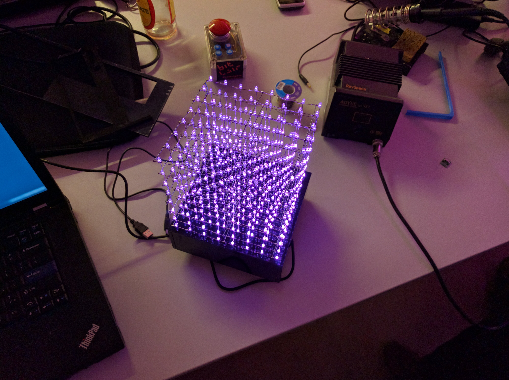
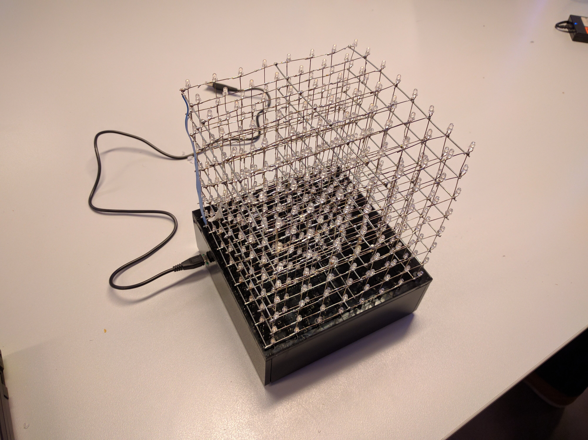

RevSpace 8x8x8 LEDCube
======================

After being abandoned for two-something years by it's previous owner, I decided
to hijack a LEDCube that was already soldered but lacking its all of its
electronics.

The hardware I built consists of four TLC5940 LED drivers controlled by an
Arduino Nano.

